# Data Flow Diagram for Endogenous Variable Subscription System

## Overview

This document provides visual representations of the data flow and component interactions in the endogenous variable subscription system. The diagrams illustrate how data moves from blockchain events to client applications through various system components.

## System Architecture Diagram

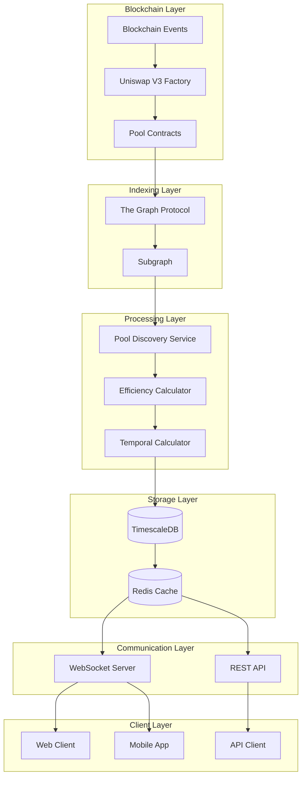

## Subscription Flow Diagram

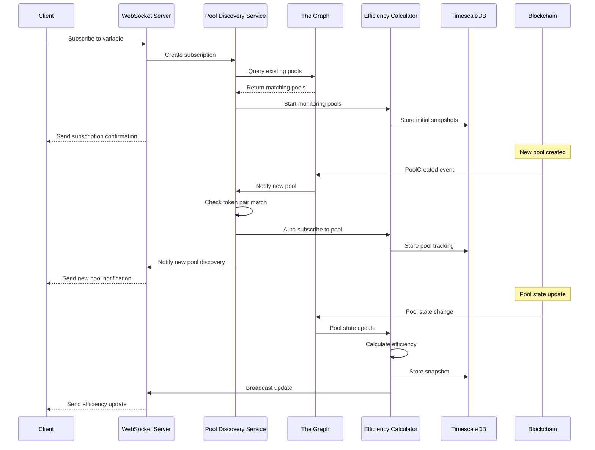

## Real-Time Update Flow

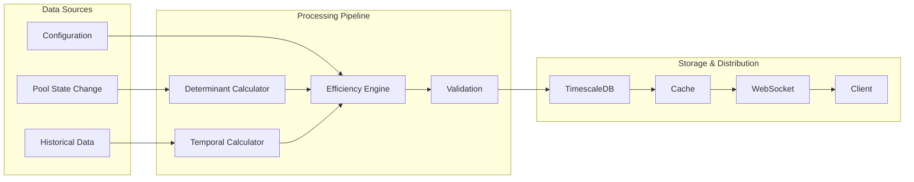

## Pool Discovery Process

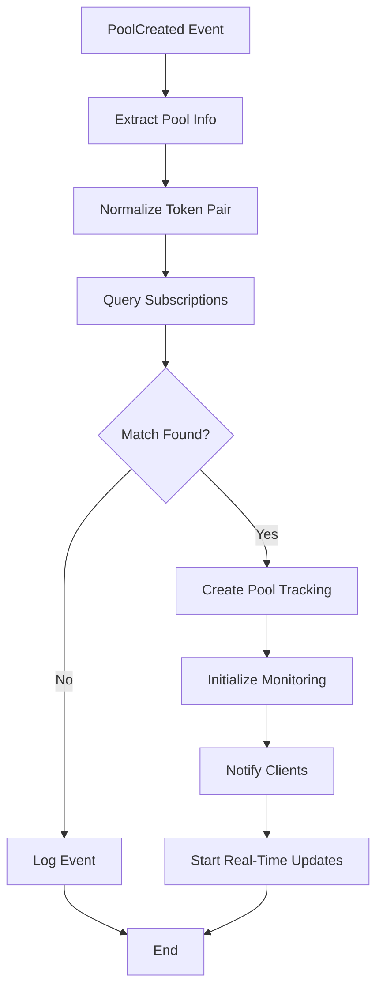

## Data Storage Architecture

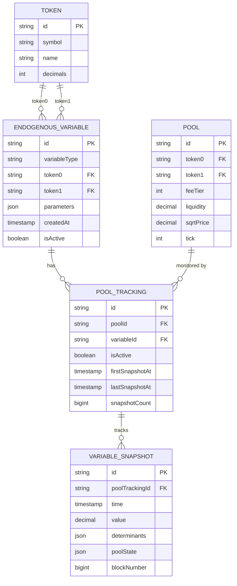

## WebSocket Message Flow

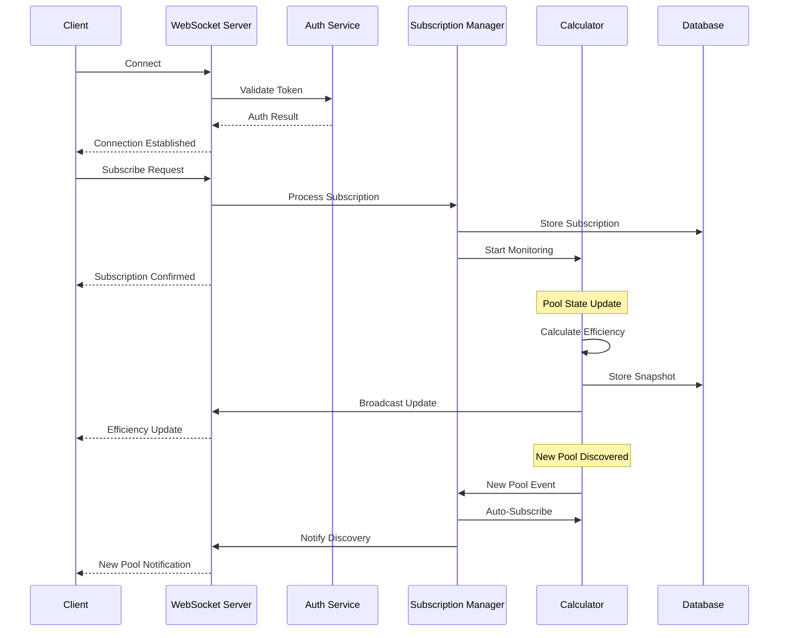

## Error Handling Flow

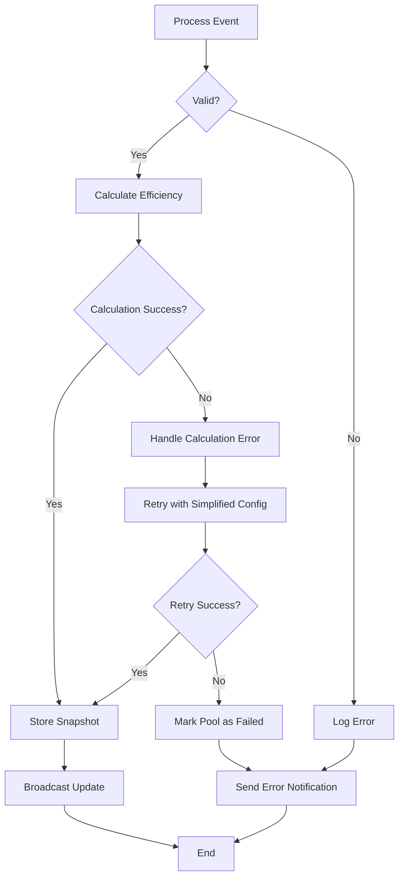

## Performance Optimization Flow

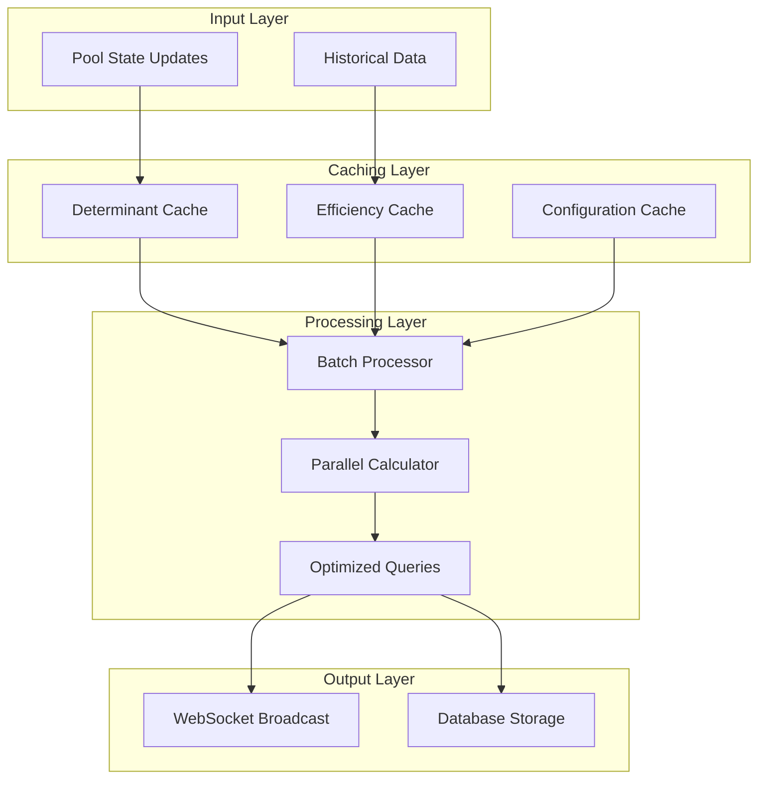

## Monitoring and Health Check Flow

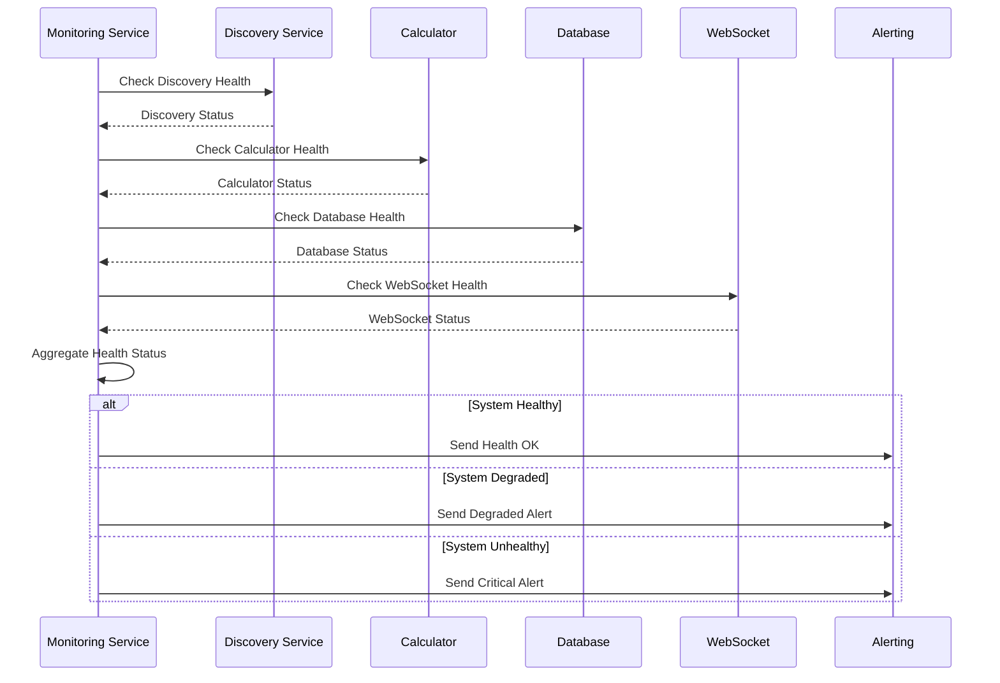

## Data Retention and Cleanup Flow

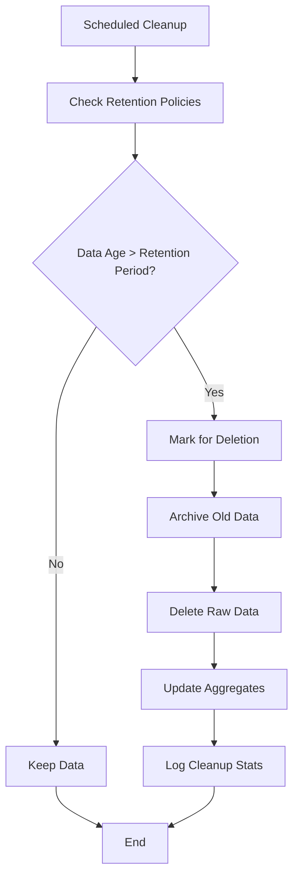

## Security and Access Control Flow

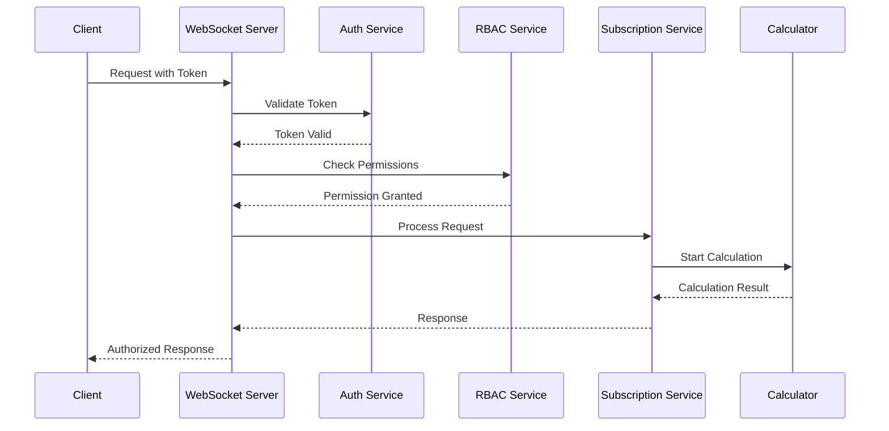

## Scalability and Load Balancing

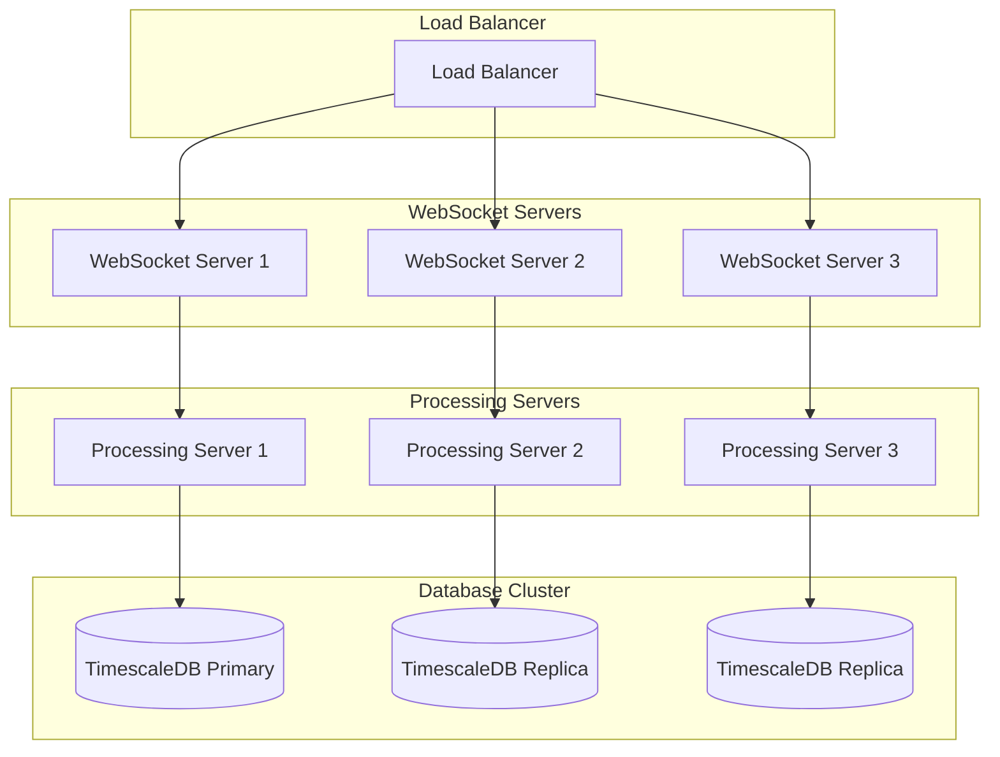

## Component Interaction Matrix

| Component | Input | Output | Dependencies |
|-----------|-------|--------|-------------|
| Pool Discovery Service | Blockchain Events | Pool Info | The Graph Protocol |
| Efficiency Calculator | Pool State | Efficiency Value | Configuration, Historical Data |
| Temporal Calculator | Historical Snapshots | Growth Rates | Database |
| WebSocket Server | Client Requests | Real-time Updates | Subscription Manager |
| Database | Snapshots | Historical Data | TimescaleDB |
| Cache | Frequent Queries | Cached Results | Redis |

## Data Volume Estimates

### Daily Data Volume
- **Pool State Updates**: ~1M events/day
- **Efficiency Calculations**: ~100K calculations/day
- **WebSocket Messages**: ~10M messages/day
- **Database Writes**: ~1M snapshots/day
- **Storage Growth**: ~10GB/day

### Performance Targets
- **Latency**: <100ms for real-time updates
- **Throughput**: 10,000+ concurrent connections
- **Availability**: 99.9% uptime
- **Data Retention**: 30 days raw, 5 years aggregated
- **Cache Hit Rate**: >90% for frequent queries

## Monitoring Metrics

### Key Performance Indicators
- **Event Processing Rate**: Events/second
- **Calculation Latency**: Average calculation time
- **WebSocket Connection Count**: Active connections
- **Database Query Performance**: Query execution time
- **Error Rate**: Failed operations percentage
- **Cache Hit Rate**: Cache effectiveness
- **Memory Usage**: System resource utilization
- **Network Bandwidth**: Data transfer rates
