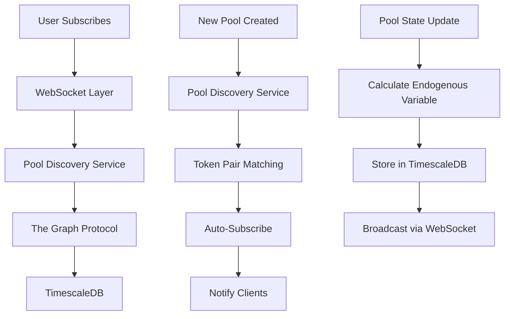

# Endogenous Variable Subscription Architecture

## Overview

This document describes the architecture for a real-time subscription system that tracks endogenous variables (like volume-liquidity efficiency) across all pools with matching token pairs. The system automatically discovers new pools with the same token pairs and subscribes to them, providing real-time updates via WebSocket connections.

## System Components

### 1. The Graph Protocol (Subgraph)
- **Purpose**: Indexes blockchain data and provides GraphQL API for querying
- **Responsibilities**:
  - Track pool creation events
  - Index pool state changes
  - Provide historical data queries
  - Handle real-time subscriptions

### 2. TimescaleDB
- **Purpose**: Time-series database for storing endogenous variable snapshots
- **Responsibilities**:
  - Store time-series data efficiently
  - Provide fast queries for historical data
  - Handle data retention policies
  - Support continuous aggregates for performance

### 3. WebSocket Layer
- **Purpose**: Real-time communication between backend and frontend
- **Responsibilities**:
  - Handle client subscriptions
  - Broadcast variable updates
  - Manage connection lifecycle
  - Handle authentication and authorization

### 4. Pool Discovery Service
- **Purpose**: Automatically detect and subscribe to new pools
- **Responsibilities**:
  - Listen to pool creation events
  - Match token pairs with existing subscriptions
  - Auto-subscribe to new pools
  - Notify clients about new pools

## Data Flow



## Token Pair Matching Algorithm

### 1. Normalization
- Sort token addresses lexicographically (token0 < token1)
- Create consistent token pair identifier: `token0_address:token1_address`

### 2. Matching Logic
```typescript
interface TokenPair {
  token0: string;
  token1: string;
}

function normalizeTokenPair(token0: string, token1: string): TokenPair {
  return token0 < token1 
    ? { token0, token1 }
    : { token0: token1, token1: token0 };
}

function matchesTokenPair(
  pair1: TokenPair, 
  pair2: TokenPair
): boolean {
  return pair1.token0 === pair2.token0 && pair1.token1 === pair2.token1;
}
```

## Subscription Lifecycle

### 1. Initial Subscription
1. User provides token addresses and variable parameters
2. System normalizes token pair
3. Query existing pools with matching token pairs
4. Create subscription for all matching pools
5. Begin real-time tracking

### 2. Auto-Discovery
1. Listen to `PoolCreated` events from factory contract
2. Extract token addresses from event
3. Normalize token pair
4. Check against existing subscriptions
5. Auto-subscribe to matching pools
6. Notify clients about new pool

### 3. Real-Time Updates
1. Pool state changes
2. Calculate endogenous variable value
3. Store snapshot in TimescaleDB
4. Broadcast update via WebSocket
5. Update client interfaces

## Component Responsibilities

### Subgraph Layer
- **Entity Management**: Track pools, tokens, and variable snapshots
- **Event Processing**: Handle pool creation and state changes
- **Query Optimization**: Efficient queries for token pair matching
- **Real-Time Subscriptions**: GraphQL subscriptions for live updates

### TimescaleDB Layer
- **Time-Series Storage**: Efficient storage of variable snapshots
- **Data Retention**: Automatic cleanup of old data
- **Performance Optimization**: Continuous aggregates and indexing
- **Historical Queries**: Fast access to historical data

### WebSocket Layer
- **Connection Management**: Handle client connections
- **Message Routing**: Route updates to subscribed clients
- **Authentication**: Verify client permissions
- **Error Handling**: Graceful handling of connection issues

### Pool Discovery Service
- **Event Listening**: Monitor blockchain for new pools
- **Token Matching**: Match new pools to existing subscriptions
- **Auto-Subscription**: Automatically subscribe to new pools
- **Notification**: Notify clients about new pools

## Scalability Considerations

### 1. Database Optimization
- Use TimescaleDB hypertables for time-series data
- Implement proper indexing for token pair queries
- Use continuous aggregates for common queries
- Set up data retention policies

### 2. WebSocket Scaling
- Use connection pooling for WebSocket connections
- Implement message queuing for high-volume updates
- Consider horizontal scaling with load balancers
- Implement connection limits and rate limiting

### 3. Subgraph Performance
- Optimize GraphQL queries for token pair matching
- Use pagination for large result sets
- Implement caching for frequently accessed data
- Monitor and optimize indexing strategies

## Security Considerations

### 1. Authentication
- Implement JWT-based authentication for WebSocket connections
- Validate client permissions for variable subscriptions
- Rate limit subscription requests

### 2. Data Validation
- Validate all input parameters
- Sanitize token addresses and parameters
- Implement bounds checking for variable values
- Handle malformed data gracefully

### 3. Access Control
- Implement role-based access control
- Restrict access to sensitive variable types
- Audit subscription activities
- Monitor for suspicious patterns

## Error Handling

### 1. Connection Errors
- Implement automatic reconnection for WebSocket clients
- Handle network timeouts gracefully
- Provide fallback mechanisms for critical data

### 2. Data Errors
- Validate all data before processing
- Handle missing or corrupted data
- Implement retry mechanisms for failed operations
- Log errors for debugging and monitoring

### 3. System Errors
- Implement circuit breakers for external services
- Handle database connection failures
- Provide graceful degradation when services are unavailable
- Monitor system health and alert on issues

## Monitoring and Observability

### 1. Metrics
- Track subscription counts and active connections
- Monitor variable calculation performance
- Measure database query performance
- Track error rates and system health

### 2. Logging
- Log all subscription events
- Track variable calculation steps
- Monitor system performance
- Audit security events

### 3. Alerting
- Alert on high error rates
- Monitor system resource usage
- Track subscription growth
- Alert on security incidents

## Implementation Phases

### Phase 1: Core Infrastructure
- Set up TimescaleDB schema
- Implement basic WebSocket server
- Create subgraph schema
- Basic subscription functionality

### Phase 2: Pool Discovery
- Implement pool discovery service
- Auto-subscription logic
- Token pair matching
- Client notifications

### Phase 3: Real-Time Updates
- Variable calculation engine
- Real-time broadcasting
- Performance optimization
- Error handling

### Phase 4: Production Features
- Security implementation
- Monitoring and alerting
- Scalability improvements
- Documentation and testing

## Success Metrics

- **Latency**: < 100ms for real-time updates
- **Throughput**: Support 10,000+ concurrent subscriptions
- **Reliability**: 99.9% uptime
- **Accuracy**: 100% data consistency
- **Scalability**: Linear scaling with infrastructure
